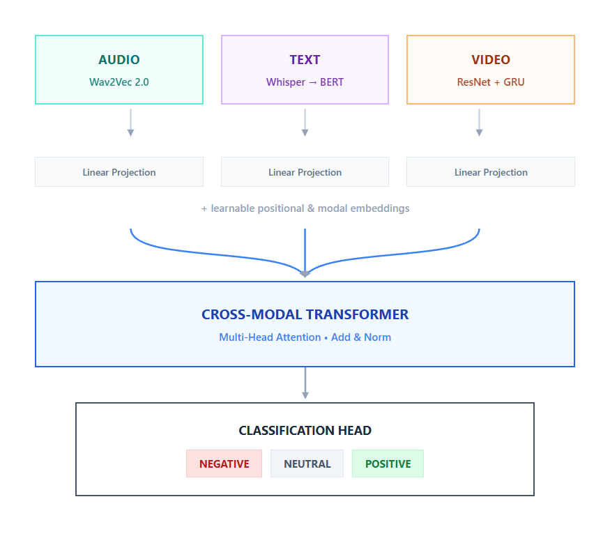

# Multimodal Congressional Speech Fusion

Multimodal fusion baseline for congressional speech sentiment classification combining text (BERT), audio (Wav2Vec2), and video (face + pose) modalities.

## Table of Contents

- [Architecture](#architecture)
- [Quick Start](#quick-start)
- [Training](#training)
- [Project Layout](#project-layout)
- [Results](#results)

---

## Architecture

Cross-modal attention fusion for 3-class sentiment classification (negative/neutral/positive).



**Pipeline:**
- **Text encoder** (BERT) extracts [CLS] token embedding
- **Audio encoder** (Wav2Vec2) extracts mean pooled embedding  
- **Video encoder** (ResNet+GRU) extracts frame+pose embedding
- **Linear projections** map all embeddings to 256d
- **Type embeddings** distinguish modalities
- **Cross-modal transformer** applies multi-head attention (4 heads) with Add & Norm
- **Classification head** outputs 3 class logits (negative/neutral/positive)

---

## Quick Start

### Install

```bash
git clone <repository-url>
cd cspan_congressionalrhetoric_fusion_baseline

# Create virtual environment (optional)
uv venv
source .venv/bin/activate  # Windows: .venv\Scripts\activate

# Install dependencies
uv sync
```

### Train

```bash
# Download data and configure paths in config_base.py first

# Unimodal baselines
python main.py --config configs.unimodal_text
python main.py --config configs.unimodal_audio
python main.py --config configs.unimodal_video

# Multimodal fusion
python main.py --config configs.baseline_hidden
```

### Inference

```bash
python inference.py --config configs.baseline_hidden --checkpoint outputs/run_name/best.pt --input-file data/test.json
```

---

## Training

### Configuration

All hyperparameters defined in `config_base.py`:

```python
@dataclass
class TrainConfig:
    epochs: int = 10
    batch_size: int = 1
    learning_rate: float = 2e-5
    weight_decay: float = 0.01
    save_dir: str = "./outputs"
    grad_clip: float = 1.0
    patience: int = 5  # Early stopping
```

Create custom configs in `configs/` by defining `get_config()` returning `FullConfig` instance.

### Metrics

Tracked per epoch:
- **Accuracy** - Overall classification accuracy
- **Macro F1** - F1 averaged across classes  
- **Confusion Matrix** - Per-class breakdown
- **Loss** - Cross-entropy loss

### Baseline Results

**Model:** Cross-Modal Attention Fusion  
**Configuration:** BERT (frozen), Wav2Vec2 (frozen), Video encoder (frozen), 256d projection, 4-head attention

| Metric | Train | Validation |
|--------|-------|------------|
| Accuracy | 97.27% | 65.33% |
| Macro F1 | 97.25% | 64.56% |
| Loss | 0.377 | 1.122 |

**Training:** 18 epochs (early stopped at epoch 18, patience=5), best F1=0.6977

**Confusion Matrix (Validation):**

|  | Class 0 | Class 1 | Class 2 |
|---|---------|---------|---------|
| **Class 0** | 19 | 4 | 3 |
| **Class 1** | 2 | 11 | 7 |
| **Class 2** | 4 | 6 | 19 |

---

## Project Layout

```
├── main.py                    # Training entry point
├── train.py                   # Training loop + validation
├── inference.py               # Inference script
├── config_base.py             # Configuration dataclasses
├── configs/
│   ├── baseline_hidden.py      # Multimodal fusion config
│   ├── baseline_late.py        # Alternative hyperparams
│   ├── unimodal_text.py
│   ├── unimodal_audio.py       # Individual modality configs
│   └── unimodal_video.py
├── models/
│   ├── text.py                # BERT encoder
│   ├── audio.py               # Wav2Vec2 encoder
│   ├── video.py               # Video encoder wrapper
│   └── fuse.py                # CrossModalAttentionFusion + MultimodalFusionModel
├── datasets/
│   └── multimodal_classification.py  # Dataset loaders
├── utils/
│   ├── collate.py             # Batch collation
│   └── metrics.py             # F1, accuracy, confusion matrix
├── sbatch/
│   ├── training.sh            # SLURM training script
│   └── dry-run-on-cpu.sh
└── outputs/
    └── run_name/              # Results per run
        ├── best.pt            # Best checkpoint
        ├── history.json       # Training metrics
        └── config.json        # Full config
```

### Key Components

| File | Purpose |
|------|---------|
| `models/fuse.py` | `CrossModalAttentionFusion`: Multi-head attention over projected embeddings |
| `models/fuse.py` | `MultimodalFusionModel`: Wrapper supporting multimodal & unimodal forward passes |
| `models/text.py` | BERT-based encoder with optional freezing |
| `models/audio.py` | Wav2Vec2 encoder with mean pooling |
| `models/video.py` | Video encoder interface (dual-stream face+pose) |
| `train.py` | Full training/validation loop with early stopping |
| `datasets/` | `FacesFramesDataset`, `TextDataset`, `AudioDataset`, `MultimodalDataset` |
| `utils/metrics.py` | Accuracy, macro F1, confusion matrix computation |

---

## References

- Vaswani et al., [Attention is All You Need](https://arxiv.org/abs/1706.03762), NeurIPS 2017
- Devlin et al., [BERT: Pre-training of Deep Bidirectional Transformers](https://arxiv.org/abs/1810.04805), NAACL 2019
- Baevski et al., [Wav2Vec 2.0: A Framework for Self-Supervised Learning of Speech Representations](https://arxiv.org/abs/2006.11477), NeurIPS 2020
